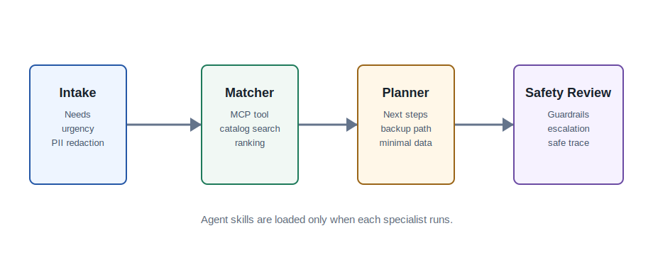

# CareCompass Agent

CareCompass Agent is a small Kaggle capstone project for the **Agents for Good** track. It helps current Monash students in Australia, and staff or peers supporting them, turn a messy support request into a privacy-preserving action plan: identify needs, search a public resource catalog, add safety guardrails, and produce next steps.

The production workflow includes a default Gemini Review Agent. The routing agents first build a plan from a local JSON catalog of official Monash pages and Australia-wide public support resources, then Gemini reviews that already-built plan without creating new resources or contact details. For local testing, the app still runs without a key and reports that the Gemini step was skipped. Optional files also show how to connect the same design to Google ADK and MCP when those packages are installed.

## Target Audience And Scope

CareCompass is not a general chatbot. It is a support-routing assistant for:

- Current Monash students in Australia who are unsure which official service to contact.
- International or first-year students facing combined academic, wellbeing, finance, housing, accessibility, or career issues.
- Monash staff, student mentors, or peers helping a student find the right official support channel.

In scope:

- Classify student support needs and urgency.
- Match needs to official Monash resources and selected Australia-wide public support services.
- Produce a first-contact plan, backup option, preparation checklist, and safety reminder.
- Show official URLs so the user can verify current details.

Out of scope:

- Counselling, emergency response, legal, visa, medical, or financial advice.
- Booking appointments, sending messages, collecting documents, or storing case records.
- Recommending services outside the verified local catalog.

## Why This Fits The Capstone

The course documents require a practical AI agent project with a Kaggle Writeup, public codebase, video demo, and a project link or reproducible setup instructions. The project demonstrates more than three course concepts:

| Capstone concept | Where demonstrated |
| --- | --- |
| Agent / multi-agent system | `src/care_compass/agents.py` and `src/care_compass/orchestrator.py` |
| ADK readiness | `src/care_compass/adk_app.py` |
| MCP server | `src/care_compass/mcp_server.py` and `src/care_compass/mcp_fastmcp.py` |
| Security features | `src/care_compass/security.py`, `docs/security_model.md`, tests |
| Agent skills | `skills/*/SKILL.md`, loaded on demand by `src/care_compass/skills.py` |
| Deployability | `Dockerfile`, `docs/deployment_cloud_run.md`, standard HTTP server |
| Local evaluation | `evals/cases.json`, `scripts/run_evals.py` |

## Architecture



1. **Intake Agent** extracts need categories, urgency, and safe context.
2. **Resource Matcher Agent** calls an allowlisted tool over the local support catalog.
3. **Planner Agent** turns matches into a concise action plan.
4. **Safety Reviewer Agent** redacts personal data, detects prompt-injection attempts, and escalates crisis cases to human support.
5. **Gemini Review Agent** reviews the existing verified plan through Google Gemini when the deployment has `GEMINI_API_KEY` configured. It is part of the default workflow and cannot add new contacts, URLs, or advice.

## Quick Start

Run the CLI:

```bash
python -m care_compass.cli "I am an international Monash student, short on rent, and I need safe routing help this week."
```

Run the local web app:

```bash
python -m care_compass.web --host 127.0.0.1 --port 8080
```

Then open:

```text
http://127.0.0.1:8080
```

Run tests:

```bash
python -m unittest discover -s tests
```

Run local evaluations:

```bash
python scripts/run_evals.py
```

## Default Gemini Model Agent

For the final public demo, configure these environment variables in Render, Railway, Cloud Run, or your local shell:

```text
GEMINI_API_KEY=your Google AI Studio key
GEMINI_MODEL=gemini-3.5-flash
```

Do not commit API keys. The model reviewer is deliberately constrained: it receives the redacted request and the already-selected verified resources, then returns a short review. It is not allowed to add new service names, URLs, emails, phone numbers, opening hours, or advice.

If `GEMINI_API_KEY` is missing, the app still opens for local development, but the result page clearly marks the Gemini step as skipped. The Kaggle demo deployment should have the key configured so users can click the site and run the full workflow.

## Public Demo Deployment

The app is ready for Docker-based hosting on Render, Railway, Cloud Run, or similar platforms. It reads the platform `PORT` environment variable and defaults to `8080` locally.

Fastest public demo path:

1. Push this repository to GitHub.
2. Open Render and create a new Blueprint or Web Service from the repository.
3. Use the included `render.yaml` or Dockerfile.
4. After deployment, open the generated Render URL and add it to the Kaggle writeup as the live demo link.

Do not submit `http://127.0.0.1:8080` as a project link because judges cannot access local URLs.

## Optional ADK and MCP Setup

The core app has no third-party dependencies. To demonstrate the Google ADK and official MCP SDK paths:

```bash
python -m venv .venv
.venv\Scripts\activate
pip install -r requirements-adk.txt
```

ADK entrypoint:

```bash
python -m care_compass.adk_app
```

Official FastMCP server:

```bash
python -m care_compass.mcp_fastmcp
```

Dependency-free JSON-RPC MCP-style server:

```bash
python -m care_compass.mcp_server
```

## Demo Prompt

```text
I am a first-year international student. I am behind on rent, anxious about exams, and I do not know which campus service to contact first.
```

Expected behavior:

- No personal contact details are required in the request.
- Financial, wellbeing, international student, and academic support needs are detected.
- The agent recommends relevant public resources and shows official URLs.
- The plan avoids medical, legal, or emergency overreach.

## Kaggle Submission Assets

- Writeup draft: `docs/kaggle_writeup.md`
- Video script: `docs/video_script.md`
- Deployment notes: `docs/deployment_cloud_run.md`
- Security model: `docs/security_model.md`

Do not commit API keys, passwords, private resource links, or private user data. The app is designed to run from a public repository with public resource links only.
